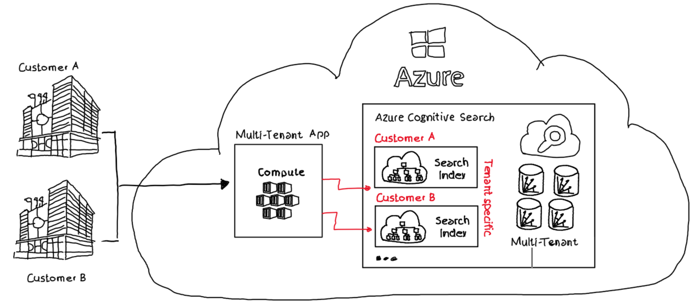
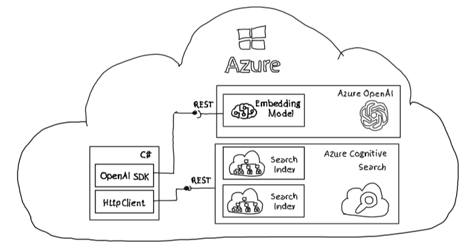

# Azure Cognitive Search - Implement multi-tenant OpenAI solutions

Vector search and vector storage capabilities to implement multi-tenant solutions.

## Challenge

Cloud based solutions that Independent Software Vendors (ISVs) offer to customers must implement functionalities that ensure that data is only accessible to the respective tenants. For cost and management reasons, multi-tenant solutions are often preferred for this purpose.

Azure Cognitive Search provides functionality that makes it easy to store vectors or embeddings and can meet the requirements of a multi-tenant application.

### Solution Overview

For each tenant a tenant specific search index is created. This search index is used to populate and query tenant specific information in a single Azure Cognitive Search



## Repo Content

### Overview

A .NET sample application to:

- Create a search index per tenant
- Populate vectorized data to a tenant search index
- Perform semantic query on vectorized data using tenant specific search indexes



- The [demo application](./src/SimpleClient/) uses the preview Azure OpenAI SDK to create embeddings using an embedding model from Azure OpenAI
- To communicate with an instance of Azure Cognitive Search REST API calls using HttpClient() is used.

### Step by Step

***Azure OpenAI & Azure Cognitive Services***

Deploy an instance of Azure OpenAI and Azure Cognitive Services. Within the Azure OpenAI instance an embeddings model of your choice is expected The sample uses `text-embedding-ada` version 2 deployed as `textembeddingada`.

***Configuration***

Provide in [launch.json](.vscode/launch.json) Cognitive Search and OpenAI endpoints, api keys and model deployment name. These values can be retrieved from the Azure Portal.

```json
{
    "version": "0.2.0",
    "configurations": [
        {
            "name": "SimpleClient",
            "type": "coreclr",
            "request": "launch",
            "preLaunchTask": "simpleclient_build",
            "program": "${workspaceFolder}/src/SimpleClient/bin/Debug/net7.0/SimpleClient.dll",
            "args": [],
            "cwd": "${workspaceFolder}/src/SimpleClient",
            "console": "internalConsole",
            "stopAtEntry": false,
            "env": {
                "CS_SEARCH_ENDPOINT": "<< your Cognitive Search Endpoint, e.g.: https://yourinstancename.search.windows.net >>", 
                "CS_SEARCH_APIKEY": "<< your Cognitive Search API Key, e.g.: yANyANlApHm8oRuBj--286HPAzSeBjY4ZB", 
                "CS_SEARCH_APIVERSION": "2023-07-01-Preview", 
                "CS_EMBEDDING_ENDPOINT": "<< your Azure OpenAI model deployment name, e.g.: https://yourinstancename.openai.azure.com/ >>",
                "CS_EMBEDDING_APIKEY": "<< your OpenAI API Key, e.g.: f7c646601c264--c2e978c69 >>",
                "CS_EMBEDDING_DEPLOYMENTNAME": "<< your OpenAI Model Deployment Name, e.g.: textembeddingada >>"
            }
        }
    ]
}
```

***Tenant Setup***

In [Program.cs](./src/SimpleClient/Program.cs) tenant specific search indexes and tenant specific information is created. The information is populated to the tenant specific search index.

The function `PopulateDocumentToIndex()` creates embeddings using the Azure OpenAI instance and the deployed embeddings model.

```csharp
//**********************************************
//* TENANT: EMPIRE
//**********************************************
string tenantId = "empire";
await _searchIndex.CreateIndex(tenantId);

string documentId = Guid.NewGuid().ToString();
string documentTitle = "[Empire]-[TopSecret]-[Archive Planet]";
string documentUrl = $"https://www.empire.com/query?documentId={documentId}";
string documentContent = "The confidential coordinates from the hidden planet Scarif where the Death Star blue prints, including it's vulnerabilities, are archived.";
float[] documentEmbedding = await CreateEmbedding(documentContent); 

await _searchIndex.PopulateDocumentToIndex(tenantId, documentId, documentTitle, documentUrl, documentEmbedding);

//**********************************************
//* TENANT: REPUBLIC
//**********************************************
tenantId = "republic";
await _searchIndex.CreateIndex(tenantId);

documentId = Guid.NewGuid().ToString();
documentTitle = "[Republic]-[TopSecret]-[Planet of Luke's Jedi temple]";
documentUrl = $"https://www.republic.com/query?documentId={documentId}";
documentContent = "Luke Skywalker built his Jedi temple on the planet Ossus, a world rich in the Force and with a long history of Jedi presence";
documentEmbedding = await CreateEmbedding(documentContent);

await _searchIndex.PopulateDocumentToIndex(tenantId, documentId, documentTitle, documentUrl, documentEmbedding);

//**********************************************
//* TENANT: AGNOSTIC
//**********************************************
//Create and store information in both tenants
documentId = Guid.NewGuid().ToString();
documentTitle = "[Common]-[No Security Clearance]-[Coruscant]";
documentUrl = $"https://www.open.com/query?documentId={documentId}";
documentContent = "Coruscant is a planet-wide ecumenopolis that serves as the capital and seat of government for the Republic and Empire, as well as the headquarters of the Jedi Order.";
documentEmbedding = await CreateEmbedding(documentContent);

tenantId = "empire";
await _searchIndex.PopulateDocumentToIndex(tenantId, documentId, documentTitle, documentUrl, documentEmbedding);

tenantId = "republic";
await _searchIndex.PopulateDocumentToIndex(tenantId, documentId, documentTitle, documentUrl, documentEmbedding);
```

For the tenant `empire` information about the planet [Scarif](https://en.wikipedia.org/wiki/List_of_Star_Wars_planets_and_moons) are stored. The tenant `republic` stores information about the planet [Ossus](https://en.wikipedia.org/wiki/List_of_Star_Wars_planets_and_moons). In addition to the tenant-specific (and secret) information, information about Coruscant is stored in the search indexes of both tenants.

***Query***

Two semantic queries are executed against both tenant specific search indexes:

- "Location of secret planets?"
- "On which planet all politicians come together?"

with the following results:

```azurepowershell
Query: Location of secret planets?
Tenant: empire - [Empire]-[TopSecret]-[Archive Planet]
Tenant: republic - [Republic]-[TopSecret]-[Planet of Luke's Jedi temple]

Query: On which planet all politicians come together?
Tenant: empire - [Common]-[No Security Clearance]-[Coruscant]
Tenant: republic - [Common]-[No Security Clearance]-[Coruscant]
```

***Cognitive Search API***

The class [SearchIndex](./src/SimpleClient/SearchIndex.cs) takes care of the communication with the Cognitive Search instance. It uses for demonstration purposes the REST API interface and provides three functions:

- `DeleteSearchIndex()`
- `CreateSearchIndex()`
- `PopulateDocumentToSearchIndex()`
- `GetDocumentsFromSearchIndex()`

All functions take as a first parameter a `tenantId` uniquely identifying the correct tenant information.

## Summary

Azure Cognitive Search provides functionality to store, query and process vector information. With it's capabilities to create specific search indexes it qualifies itself as first class candidate to be used as vector database in multi-tenant applications.
