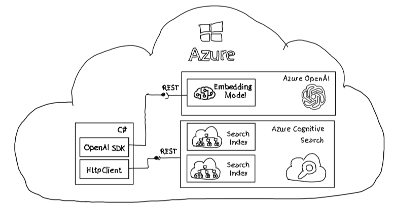

# SimpleClient - c# application

## Overview

A sample application to:

- Create a search index per tenant
- Populate vectorized data to a tenant search index
- Perform semantic query on vectorized data using tenant specific search indexes

